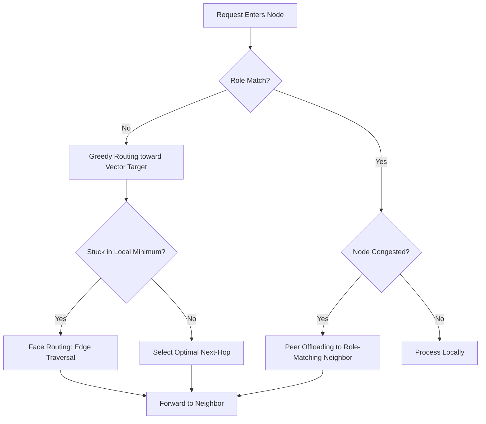

# AVRS — Adaptive Vector Routing System

[](https://opensource.org/licenses/MIT)
[](https://www.python.org/downloads/)
[](https://www.python.org/downloads/)
[]()

AVRS is a next-generation routing framework designed for **Edge, IoT, and high-density Microservice meshes**. It replaces traditional routing tables with **Geometric Vector Intelligence**, allowing nodes to make purely local, greedy decisions that navigate complex network topologies without a central coordinator.

---

## 🏗 System Architecture

AVRS operates on a **Universal Node Model** where every service identity is mapped to a coordinate in a high-dimensional vector space.

### Central Pillars:
1.  **Decentralized Intelligence**: No global routing tables. Hops are calculated in real-time.
2.  **Hybrid Topologies**: Merges K-Nearest Neighbors (KNN) for local speed with Delaunay Triangulation for global routing stability.
3.  **Adaptive Scoring**: A dynamic multi-objective function balances progress-to-target, congestion, and trust.
4.  **Semantic Load Balancing**: Automated peer offloading for stateless or role-equivalent services.

### 📊 Routing Lifecycle (Visualized)


---

## 🧠 Technical Deep-Dive

### 1. The Decision Engine (Adaptive Scoring)
Every routing decision is powered by a weighted multi-objective scoring function:

$$Score = \alpha \cdot \text{Cosine}(\vec{V}_{next}, \vec{V}_{target}) + \beta \cdot \Delta\text{Distance} - \gamma \cdot \text{NormalizedLoad} + \delta \cdot \text{Trust}$$

*   **$\alpha$ (Directional Velocity)**: Prioritizes neighbors pointing exactly toward the target.
*   **$\beta$ (Geometric Gain)**: Prioritizes absolute reduction in Euclidean distance.
*   **$\gamma$ (Congestion Backpressure)**: Penalizes nodes with high workload to prevent hotspots.
*   **$\delta$ (Reputation Weight)**: Avoids nodes with low "Trust" scores (potential attackers or failing hardware).

### 2. Semantic Peer Offloading
AVRS nodes are "role-aware." When a node (Amber state) exceeds its `overload_threshold`, it automatically prioritizes routing to a "Peer Proxy"—a neighbor with the identical `role`—effectively acting as a decentralized load balancer.

### 3. Resilience & Self-Healing
If a node detects a neighbor has failed:
1.  It triggers a **Localized Topology Heal**.
2.  The routing engine switches to **Fallback Mode**, ignoring the dead hop.
3.  If trapped in a local minimum, **Face Routing** (traversing polygon edges in the planar projection) is activated to escape.

---

## 🛣 Production Roadmap

AVRS is transitioning from an **Advanced Simulation** to a **Production Infrastructure**.

| Stage | Focus | Status |
| :--- | :--- | :--- |
| **Stage 1** | **Stabilization**: Unified Node Model, HMAC Hardening. | ✅ Complete |
| **Stage 2** | **Optimization**: Localized Delaunay updates, Weight Controller. | 🚧 In Progress |
| **Stage 3** | **Scaling**: $10^5$ Node simulation, persistent state logic. | 📅 Planned |
| **Stage 4** | **Intelligence**: Predictive ML for weight tuning ($\alpha, \beta, \gamma$). | 📅 Planned |
| **Stage 5** | **Production**: mTLS integration, Rust-based core, CLI tools. | 🚀 Vision |

---

## 🛠 Installation & Usage

### 🚀 Get Started
```bash
# Clone the repository
git clone https://github.com/username/adaptive-vector-routing.git
cd adaptive-vector-routing

# Install dependencies
pip install -r requirements.rs

# Start the dashboard
python server.py
```

### 🧪 Running Tests
The project features a comprehensive verification suite:
- **Core Engine**: `python tests.py`
- **Semantic Pools**: `python semantic_pool_tests.py`
- **API Integrity**: `python test_api.py`

---

## 📄 License
This project is licensed under the MIT License - see the LICENSE file for details.

*Built for the next generation of decentralized infrastructure.*

---

## 🛠 Getting Started

### Prerequisites
- Python 3.9+
- Pip (Python Package Manager)

### Installation
```bash
# Clone the repository
git clone https://github.com/your-username/adaptive-router.git
cd adaptive-router

# Install dependencies
pip install -r requirements.txt
```

### Running the Simulator
```bash
# Start the Backend Server
python server.py

# Open your browser and navigate to:
http://127.0.0.1:5000
```

---

## 📂 Project Structure

- `/avrs` — Core engine: Vector math, Routing logic, and Network models.
- `/dashboard` — High-DPI Canvas frontend (HTML/JS/CSS).
- `server.py` — Flask API and Simulator coordinator.
- `topology_engine.py` — Delaunay and KNN algorithms.
- `gateway.py` — Security and protocol validation layer.

---

## 📜 License
This project is licensed under the MIT License - see the LICENSE file for details.

*Developed by the AVRS Team — Pushing the boundaries of decentralized intelligence.*